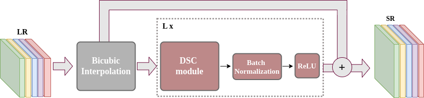
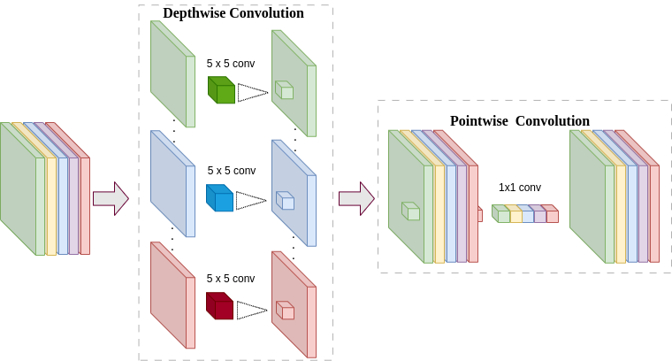
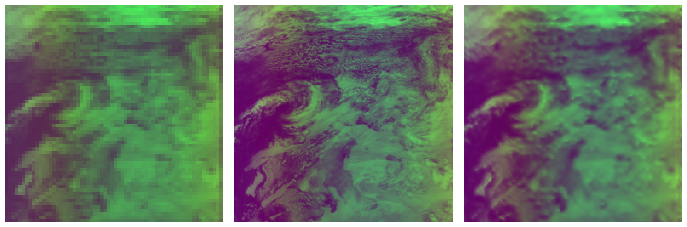
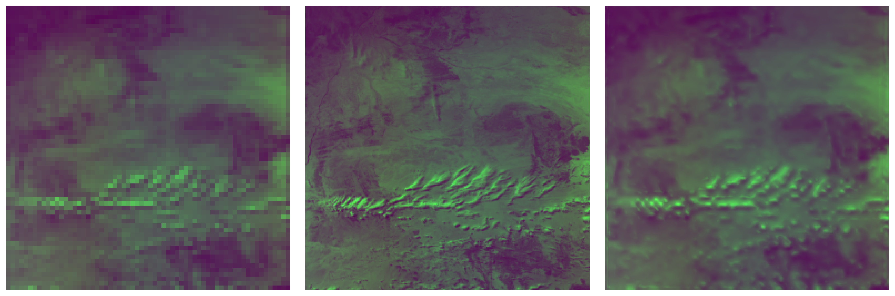
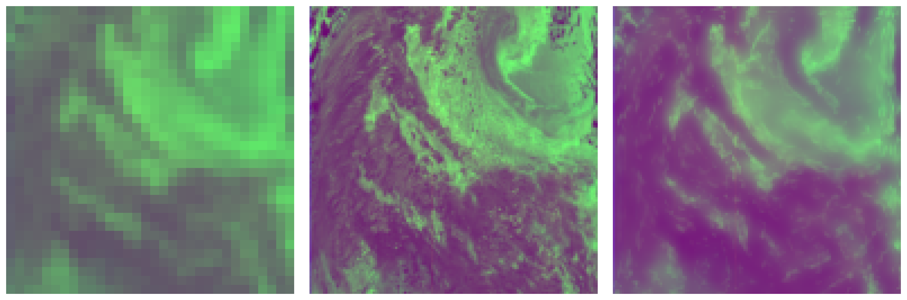

# Depth Separable Architecture for Sentinel-5P Super-Resolution

Hyam Omar Ali¹ ², Romain Abraham¹, Bruno Galerne¹ ³  

¹ Institut Denis Poisson, Université d’Orléans, Université de Tours, CNRS, France  
² Faculty of Mathematical Sciences, University of Khartoum, Sudan  
³ Institut Universitaire de France (IUF)


This repository contains the implementation of the [S5-DSCR model](https://arxiv.org/abs/2501.17210), a novel super-resolution (SR) approach designed to enhance the spatial resolution of Sentinel-5 Precursor (S5P) satellite data. The S5P satellite provides extensive hyperspectral (HS) images across eight spectral bands, each containing approximately 500 channels. The S5-DSCR model leverages Depth Separable Convolution (DSC) architecture to effectively exploit cross-channel correlations, thereby improving the spatial resolution of S5P data. 

---

## Objectives

- Improve the spatial resolution of S5P data by addressing the physical limitations of S5P's spatial resolution by applying advanced SR techniques.
- Use DSC architecture to exploit spatial and spectral relationships within hyperspectral images.
- Train the model separately for each of the eight spectral bands of S5P data to account for their unique spectral characteristics.

---

## Dataset

We used Sentinel-5P radiance data as the primary source of images for this study. These data are freely accessible on [Copernicus’ official website](https://dataspace.copernicus.eu/) as Level-1B radiance data. The dataset comprises data from $15$ orbits covering distinct regions acquired on January 4, 2023, and September 7, 2023. 

Each orbit contains radiance data of eight distinct bands with around and each of these spectral bands contain around 500 channels. Due to orbital and regional variations, the radiance data exhibits various spatial dimensions. The full radiance image spans a range of $4172$ to $3735$ along-track (scanlines) and $450$ to $215$  across-track (ground pixels), depending on the specific region and band. To ensure consistency and computational efficiency,  we cropped each radiance image into multiple images of size $512\times256$ for all bands and $512\times215$ for SWIR bands.


<p align="center"><em>Figure 1: Full radiance image (HR) with corresponding cropped images. From top to bottom and left to right, the cropped images are shown in the same order as they appear within the full image.</em></p>

The HS images were degraded using the [degradation model](https://github.com/alcarbone/S5P_SISR_Toolbox/blob/main/) to simulate the LR images. This process involves simulating the real-world image acquisition process, such as blurring, to create realistic LR images that closely resemble the actual HS images. A scaling factor of $4$ was utilized to downsample the HR images.

---

## Methodology

The S5-DSCR model employs DSC architecture to perform spatial super-resolution by effectively capturing interdependencies across all spectral channels while reducing computational complexity. We coupled DSC with residual connections to enhance feature extraction and stability.



<p align="center"><em>Figure 2: Architecture of S5-DSCR (L=5) and S5-DSCR-S (L=1) models</em></p>



<p align="center"><em>Figure 3: DSC module</em></p>


---

## Results




<p align="center"><em>Figure 4: SR results of S5-DSCR model for, from top to bottom,  bands 3, 5 and 7, with, from left to right, LR, ground truth HR, and our result. For visualization, each image is displayed in the first three PCA components of the ground truth</em></p>


---

## Citation

If you use this code, please cite:

```bibtex
@article{ali2025depth,
  title={Depth Separable architecture for Sentinel-5P Super-Resolution},
  author={Ali, Hyam Omar and Abraham, Romain and Galerne, Bruno},
  journal={arXiv preprint arXiv:2501.17210},
  year={2025}
}
